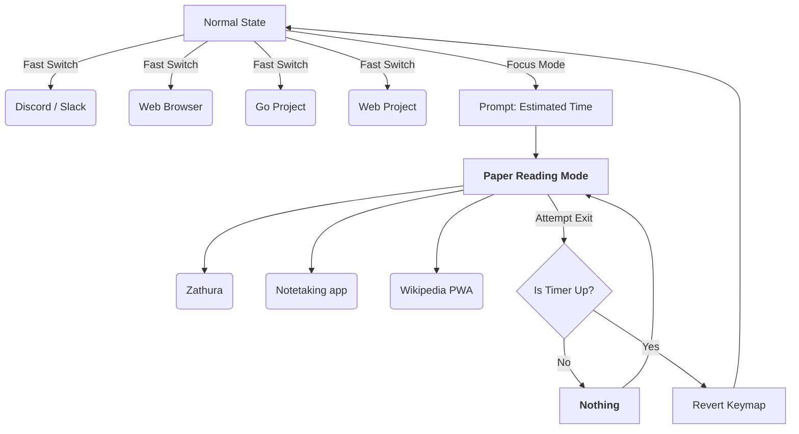

## Tiling window managers are fast

I've been using tiling window managers (I use Sway btw) for years now, and one thing that I like about it is the reliability of the experience. Organizing your windows into workspaces (or virtual desktops) means any window you open is always where you expect it to be.

One powerful thing that window managers offer is a completely keyboard-driven experience. Any action I want to perform is just a few keystrokes away. This leads to fast navigation throughout my desktop, with no wasted motion.

## Tiling window managers lend themselves to automation

One of the things I first liked about tiling window managers is being able to name workspaces. By naming my workspaces, I know to group windows together based on the task they perform. For example, my "comms" workspace contains all my chat applications, like my email and Slack.

When configuring my window manager, I noticed every keymap executes a command. So when I realized I was opening the same windows in the same workspaces day after day, I wrote a little script [^script] to automate that. It checks if a window is open on a specific workspace, opens it if it isn't, and switches to that workspace. Since I always have Discord on a specific workspace, this means that I always only have to hit a single keypress and I’m always taken to a Discord window regardless of what I’m doing currently or if the application is open at all.

So yeah, window managers let you script them, launch applications quickly, and navigate through your opened windows like butter. What's the catch?

## Low cost context switching isn't actually low cost

One of the outcomes of reducing the friction of desktop actions is, you guessed it, that the cost to switch between tasks is low. My setup made it trivially easy to jump to my email or hop on Discord, but this means I'd created the perfect procrastination machine.

The smallest amount of idle time and I'm already on a different task, since switching workspaces has a tiny action cost. But this doesn’t mean that switching is free. Context switching prevents you from focusing deeply, since you have to gather that short-term context you lose every time you switch to a different task. For example, when I’m waiting for a cargo compile to finish, my muscle memory already moves me to a browser tab before I've even made the conscious decision to look away.

This is something that isn't talked about when discussing the benefits of using a tiling window manager. Micro-optimizing your desktop experience sometimes gives you worse results than just sticking with a default environment. There is such a thing as too much freedom.

Frequent, low-resistance context switching induces a cognitive friction that robs me of the ability to think about problems for long periods of time because my mind is split between many problems at once. I always thought the bottleneck was how fast I could move around, but context switching is what wastes more time. It sounds paradoxical, but removing friction in this case *increases* cognitive fragmentation.

The obvious solution is to add some friction back in. And since I use a modal editor, I thought my desktop should also operate on a modal paradigm.

## Treat your desktop as a state machine

There's a balance to be had with removing friction while not giving yourself too much freedom. Working with a traditional desktop and hitting alt-tab five times to go back and forth between three applications is just as bad as the "twitchy" switching I mentioned above. The way to keep the organizational advantages of a workspace-based workflow while avoiding fragmentation is to increase the cost of switching.

There are times when I want to be able to move around rapidly and times when context switching kills my productivity. One of these activities is literature review. Reading technically dense papers requires thought and reflection, and sometimes that means that I switch tasks instead of taking a moment to internalize what I'm reading. Soft blockers still require conscious effort and internal motivation, both of which are hard to come by all the time.

## Modal Computing 

This is where Sway's "modes" come in. They essentially act as a layer map over your keyboard. What's interesting is that modes don't define a way to get back to the default state.

Using this, I built a "focus" mode [^config]. First, I'm prompted for an estimation of how long I think my task might take and the program locks down my computer by unbinding almost all keys. No workspace switching, no new windows, and no launcher. This even includes unbinding my power switch so I can’t even turn my computer off to escape the boredom of a tedious task [^1].

When I try to exit this mode, the script checks if my estimated amount of time has passed; if not, it simply refuses to return to the default state.

Restricting how I interact with my desktop is counterintuitively freeing. There’s only one thing I can work on, which includes only the applications I had open before switching modes. It makes my device feel purpose-built, like it was designed for that single task. I’m forced into action, leaving me with no choice but to engage with the problem in front of me or walk away from the screen entirely.

Once my task time is up I'm able to revert the keymap back to its default, high-speed state.
 
## Results 

Modal Computing is effective when I have mentally intensive tasks like reading papers. I was reading a paper on one class classification[^2] earlier and I was bouncing to other workspaces the second the math got difficult. Once I activated my mode for paper reading, I was restricted to just the pdf viewer, Emacs for notetaking and Wikipedia as a PWA [^3] . By the end of my session, I was able to work through all the math instead of skimming through it. Being able to read and take notes without the option to switch to an LLM forces you into a flow state. By giving my undivided attention to the task at hand, I understand papers much more deeply. If I finish the task earlier than my estimate, I take a well-deserved rest from my screen for the remaining duration of time.

## Productivity Is About Constraints, Not Speed

A common mistake in productivity tooling is assuming that faster interactions inherently produce better outcomes. While this is mostly true, when the cost of an action nears zero, the more important factor becomes intent.

This is where your desktop should adopt a modal paradigm to enforce intent. When the freedom of your computer becomes a liability, you need a system to keep you grounded. Speed alone does not let you focus. In some cases, the most "productive" interface is the one that knows how to stop you and say "no."

---
[^script]: https://github.com/chess10kp/configfiles/blob/main/scripts/mode/sway-goto-if-not-start
[^1]: Unbinding the key in Sway isn't enough to stop me from powering off. My script uses `sed` to change HandlePowerKey=ignore in /etc/systemd/logind.conf and restarts logind.service
[^2]: https://proceedings.neurips.cc/paper_files/paper/1999/file/8725fb777f25776ffa9076e44fcfd776-Paper.pdf
[^3]: Any website can become a native app when you launch chromium like `chromium --app\"https://wikipedia.org\"`   
[^config]: `mode "focus" { # that's it }`
